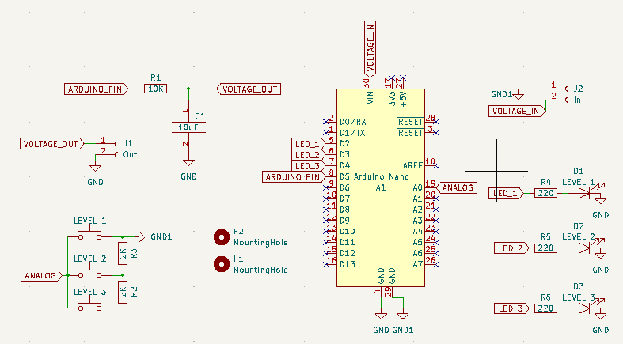

Arduino convert from PWM to Voltage. In this example is used Arduino Nano.

Output pin depends on `analogWrite` value give from 0v to 4.5v

## Scheme XIAO

## Kicad XIAO
Board|PCB
----|----
|

## Scheme

## Kicad
Board|PCB filled|PCB
----|----|----
||

## Final
